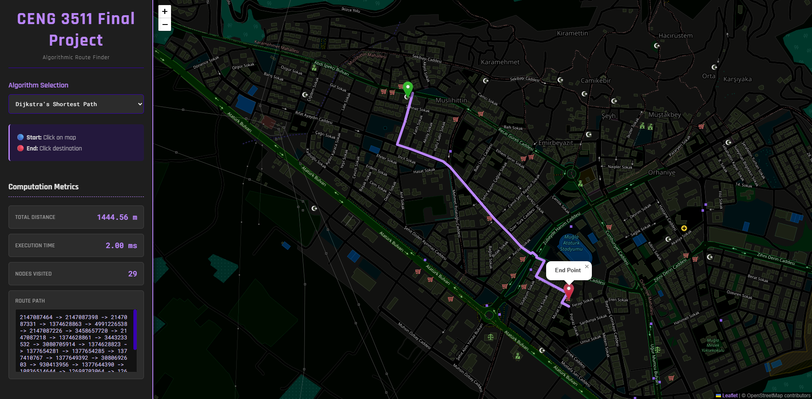

Smart Nav - Algorithmic Route Finder
====================================

_(Note: You can replace this link with an actual screenshot of your application running)_

**Smart Route Navigator** is a web-based routing application developed to visualize and compare different pathfinding algorithms on a real-world map graph. The project focuses on the Menteşe/Muğla region and provides an interactive "Cyberpunk" styled dashboard to analyze the performance of **Dijkstra**, **A**\*, **BFS**, and **DFS** algorithms in real-time.



🚀 Features
-----------

*   **Interactive Map:** Built with Leaflet.js, featuring a custom dark-mode filter for better visualization.
    
*   **Multi-Algorithm Support:**
    
    *   **Dijkstra:** Guarantees the shortest path.
        
    *   **A* (A-Star):** Optimized search using heuristics.
        
    *   **BFS (Breadth-First Search):** Finds the path with the least number of stops (nodes).
        
    *   **DFS (Depth-First Search):** Explores paths deeply (demonstrates non-optimal routing).
        
*   **Performance Metrics:** Real-time calculation of distance, execution time (ms), and step count.
    
*   **Dynamic UI:** Modern dashboard design with algorithm-specific path coloring.
    
*   **Backend:** Powered by Python/Flask with modular algorithm implementations.
    

🛠 Tech Stack
-------------

*   **Backend:** Python 3, Flask
    
*   **Frontend:** HTML5, CSS3 (Flexbox/Grid), JavaScript (ES6)
    
*   **Mapping:** Leaflet.js, OpenStreetMap (Custom Filters)
    
*   **Data Structure:** JSON based Graph (Nodes & Weighted Edges)
    
*   **Libraries:** geopy (for geodesic distance calculations)
    

📂 Project Structure
--------------------

```
Smart-Route-Navigator
├── assets/
├── static/
│   ├──asssets/
│   │   ├──favicon.png
│   ├── script.js
│   └── style.css
├── templates/
│   └── index.html 
├── a_star_search.py
├── app.py
├── bfs.py
├── dfs.py
├── dijkstra.py
├── LICENSE
├── mugla_graph.md
├── output.txt
└── README.md
```
⚙️ Installation & Setup
-----------------------

1.  **Clone the Repository**

```bash
git clone https://github.com/uslanozan/Smart-Route-Navigator.git

cd  Smart-Route-Navigator
```
    
2.  **Install Dependencies**

```bash
pip install -r requirements.txt
```
    
3.  **Run the Application**
```bash
python app.py
```

    
4.  **Access the Dashboard**

Open your browser and go to:http://127.0.0.1:5000
    

🧠 Algorithms Explained
-----------------------

### 1\. Dijkstra's Algorithm

The gold standard for finding the shortest path in a weighted graph. It explores all possible paths systematically to ensure the optimal route is found based on distance.

*   _Best for:_ Precision and guarantee of the shortest route.
    

### 2\. A\* (A-Star) Search

An extension of Dijkstra that uses a heuristic function (distance to the goal) to guide the search. It prioritizes nodes closer to the destination.

*   _Best for:_ Performance and speed in real-world navigation.
    

### 3\. BFS (Breadth-First Search)

Explores the graph layer by layer. It ignores road distances and focuses on the number of "hops" or intersections.

*   _Best for:_ Finding the route with the fewest turns/intersections, regardless of distance.
    

### 4\. DFS (Depth-First Search)

Explores as far as possible along each branch before backtracking. It does not guarantee the shortest path and often produces long, winding routes.

*   _Best for:_ Educational comparison to show how _not_ to route in navigation systems, or for maze solving.
    

🎨 Visual Guide
---------------

The application uses color coding to distinguish algorithm behaviors:

*   🟣 **Purple:** Dijkstra (Standard)
    
*   🔵 **Teal:** A\* (Optimized)
    
*   🔴 **Pink:** BFS (Least Hops)
    
*   🟠 **Orange:** DFS (Exploration)